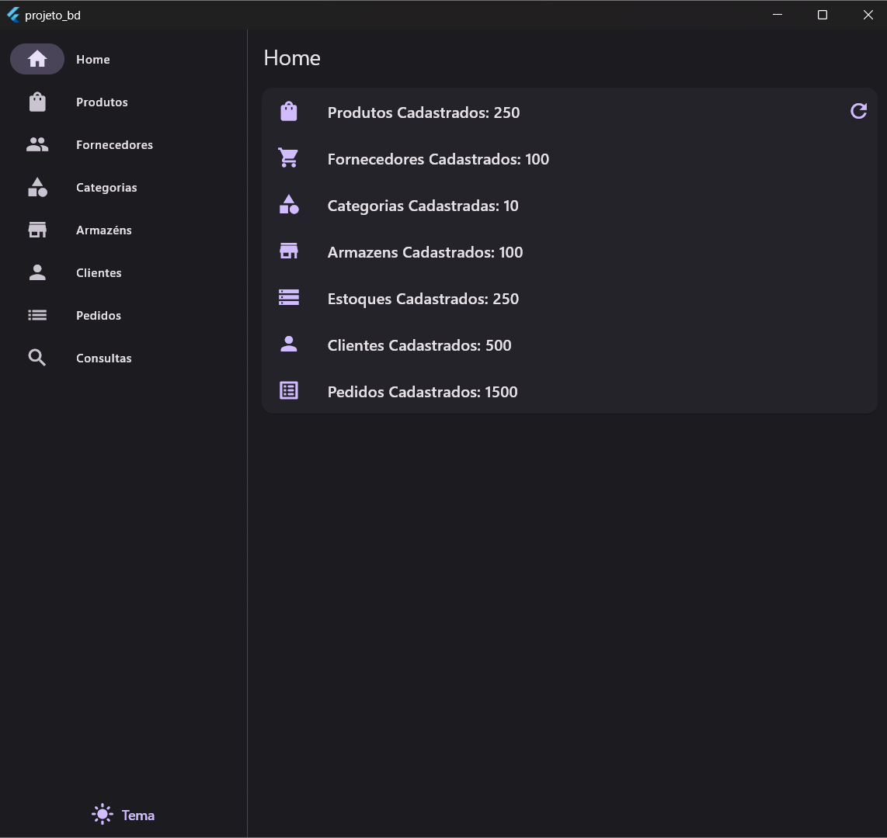
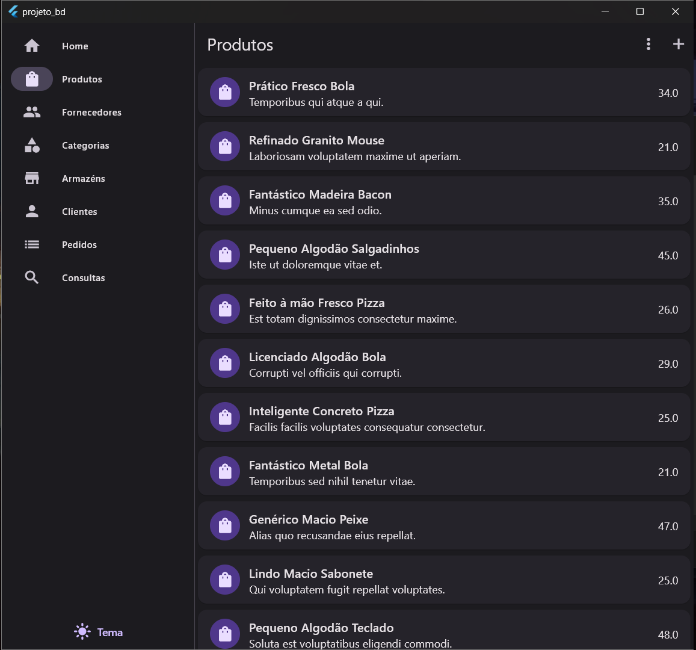
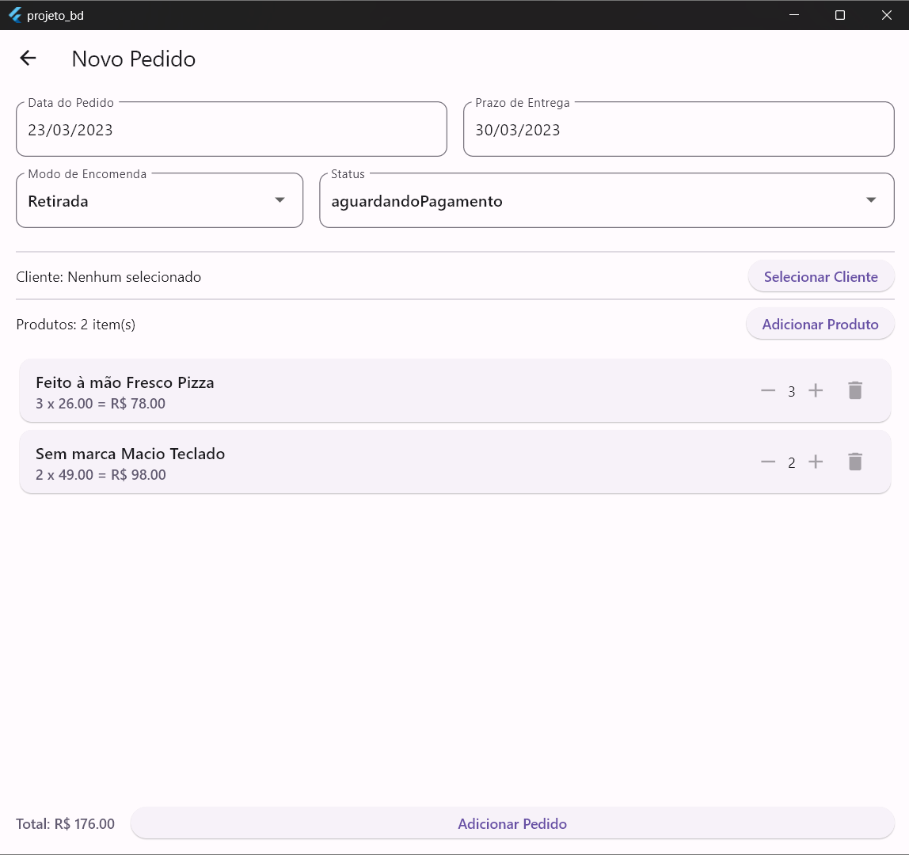
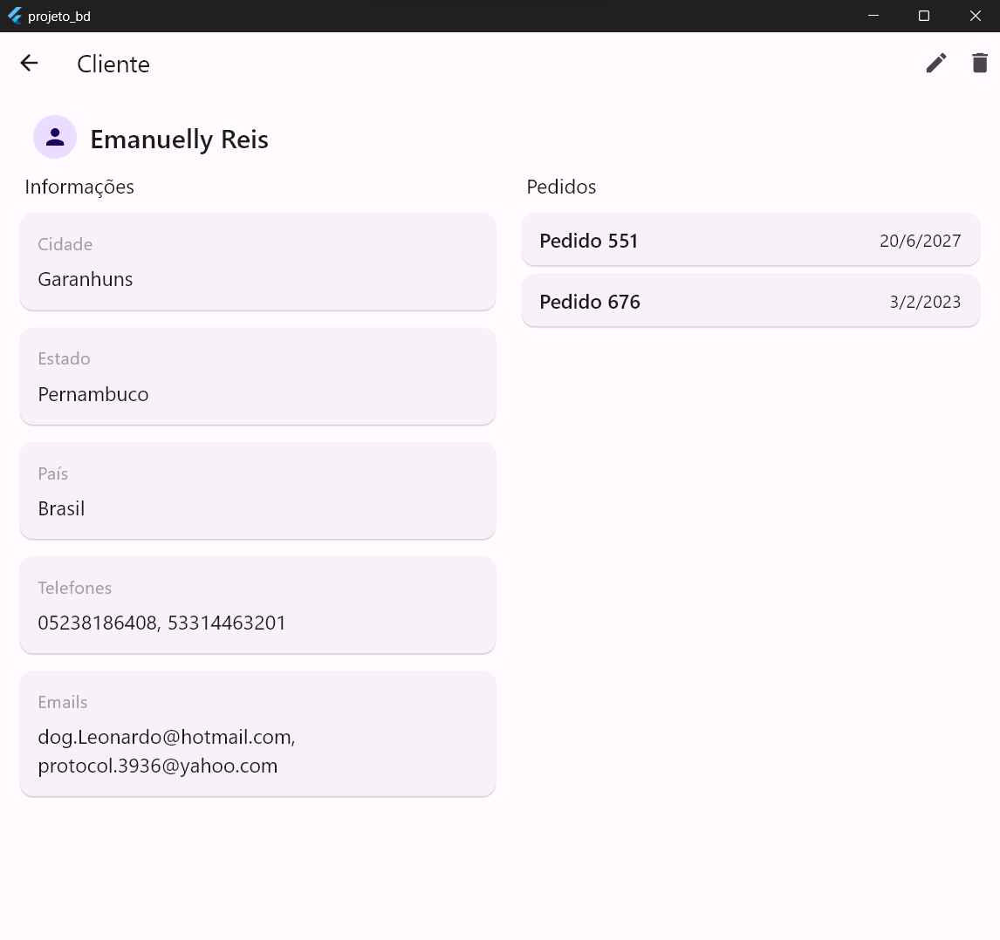

# Projeto Banco de Dados - 2022.1 - UFAPE

Projeto da disciplina de Banco de Dados, do curso de Ciência da Computação da Universidade Federal do Agreste de Pernambuco (UFAPE), ministrada pelo professor Dimas Cassimiro do Nascimento Filho.

## Equipe

- [Alex Lopes](https://github.com/alexlsilva7)
- [José Elias](https://github.com/Eliaz500)
- [Guilherme Rutemberg](https://github.com/GuiSysLima)
- [José Alves](https://github.com/IBORD)

## Documentação
### Requisitos do Projeto

O banco de dados deve armazenar informações de produtos, pedidos, clientes, estoques e outras informações relacionadas. Um produto deve ser identificado por um identificador (ID), o qual deve ser único e sequencial para cada produto. Todo produto tem um nome, descrição, data de garantia, valor (numérico) de status, preço de custo, preço de venda e preço de venda mínimo. Um produto pode ter diversos nomes e descrições em idiomas diferentes. Os produtos são classificados em diferentes categorias, sendo que cada categoria possui um ID próprio, um nome e uma descrição. Além disso, deve ser possível identificar o fornecedor de um produto, tal que cada fornecedor tem um nome, localidade, tipo de fornecedor (pessoa física ou jurídica) e número do CNPJ ou do CPF. O estoque deve ser identificado unicamente por um ID (único e sequencial), além de possuir um código. Um estoque sempre está relacionado a um único produto, identificando a quantidade existente de um determinado produto. Por sua vez, um armazém é composto por um ou mais estoques. Além disso, cada armazém possui um ID único e sequencial, além de nome e endereço do armazém. Um pedido realizado por um cliente pode conter diversos produtos diferentes, sendo que os diferentes produtos de uma compra podem ser encomendados em quantidades diferentes. Por sua vez, o preço do produto em um pedido pode ser diferente do preço de venda padrão associado ao produto, mas não pode ser inferior ao preço mínimo de venda do produto. Um pedido deve ser identificado unicamente e sequencialmente por um ID, além de constar informações sobre data do pedido, modo de encomenda (presencial ou online), o cliente que realizou o pedido, o status do pedido e a data de prazo de entrega do pedido. Finalmente, cada cliente deve ser identificado unicamente e sequencialmente por um ID, além de constar dados sobre o nome, os telefone(s), o país, estado, cidade, e-mail(s), limite de crédito ($) e data de cadastro do cliente.
### Modelo Conceitual (ER)

### Modelo Lógico (Relacional)

- [Modelo Relacional](docs/Modelo_Relacional.pdf)

### Consultas do Projeto

- [Consultas](docs/consultas.md)

### SGBD

Foi sorteado o SGBD [MySQL](https://www.mysql.com/) para realizar a aplicação e o seminário.
## Aplicação

### Requisitos

Implementar um programa com interface gráfica para apresentar os resultados das consultas do projeto. Recomendado implementar algumas telas para prover funcionalidades CRUD (criar, recuperar, atualizar e remover) de algumas entidades do BD (e.g., pedido, cliente armazém etc). Utilizar a linguagem de programação que preferir. Porém, o SGBD deve ser aquele sorteado para a equipe.

### Configuração do banco de dados

- Criar o banco de dados `projeto-bd`:
- Selecionar o banco de dados `projeto-bd`:
- Executar o script [create_tables_and_populate.sql](docs/sql/create_tables_and_populate.sql) para criar as tabelas e popular o banco de dados com dados de exemplo.
- Alterar as configurações de acesso ao banco de dados no arquivo [db_helper.dart](lib/app/core/helpers/db_helper.dart)

### Execução

- Ter o [Flutter](https://flutter.dev/) instalado;
- Configurar o ambiente de desenvolvimento para o sistema operacional desejado;
    - [Windows](https://docs.flutter.dev/get-started/install/windows#additional-windows-requirements)
        - Instalar o [Visual Studio](https://docs.flutter.dev/get-started/install/windows#additional-windows-requirements) com o pacote de desenvolvimento para desktop com C++;
    - [Linux](https://docs.flutter.dev/get-started/install/linux#additional-linux-requirements)
        - Executar no terminal (para sistemas baseados no Ubuntu): `sudo apt-get install clang cmake ninja-build pkg-config libgtk-3-dev liblzma-dev`
- Instalar as dependências do projeto: `flutter pub get` (executar dentro da pasta do projeto)
- Executar o projeto: `flutter run -d windows` ou `flutter run -d linux`; (executar dentro da pasta do projeto)

### Screenshots

 

## Seminário

- Tema: "Transações em Banco de Dados"
- Slides: Em breve
